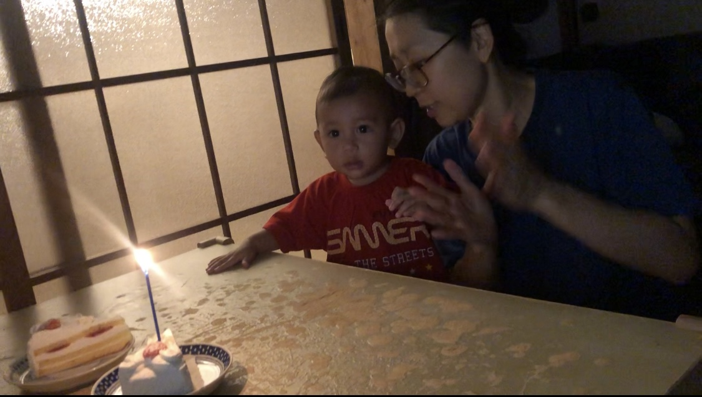

Last year, 27th August at 0145 JST, Tachan was born. It's 26th August today and time is 2351 JST and he is fast asleep by my side<!-- truncate --> as I'm writing this. He looks more cute and adorable while sleeping and I've to put all my strenth resisting myself not to hug him tightly and shower him with kisses.

About 90 minutes before, we celebrated his first birthday. Nothing fancy. Just three of us. Kochan didn't join. We didn't have any plans for celebration today as the birthday party is on 31st (weekend), but somehow we still bought a small cake and couldn't resist ourselves.

He was overjoyed looking at the candle and enjoyed the Happy Birthday song a lot.

Once the candle went out, he was shocked and surprised but started giggling again.

Thank you Mahadev to bless us with such a wonderful gift. Thank you always.

Thank you Tachan for choosing us to be your parents. Big Love, Papa.
